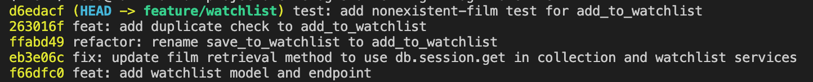

# PR Response Doc — CineLog Watchlist Feature

## AI Usage
<!-- Fill in at the end — how you used AI tools during this project -->

## Comment 1 — Rename
**What I did:** I renamed all instances of `save_to_watchlist()` to `add_to_watchlist()`.
**How I verified:** I verified that all instances have been changed by searching the project for save_to_watchlist. No matches were found.

## Comment 2 — Deduplication
**What I did:** I copied the deduplication logic from  `add_to_collection()` to `add_to_watchlist()`. I changed `CollectionEntry` to `WatchlistEntry`, added AlreadyInWatchlistError to the docstring, and replaced `AlreadyInCollectionError` with `AlreadyInWatchlistError`.
**How I verified:** I asked Claude to verify that the logic looks correct.

## Comment 3 — Missing test
**What I did:** I copied the `test_add_to_collection_nonexistent_film_raises` test from `tests/test_collection.py` to the newly created `tests/test_watchlist.py`. I changed the name of the test to `test_add_to_watchlist_nonexistent_film_raises` and replaced `add_to_collection` with `add_to_watchlist`.
**How I verified:** I ran the tests to make sure that it worked and nothing else was broken.

## Comment 4 — Default visibility
**My position:** Keep `public=True`
**Reasoning:** Since CineLog is a community film tracking app, many users may want to share their watchlists. Being able to showcase their watchlist and see others' watchlists may be a core reason they use the app. Making the watchlists public by default will align more with the context of CineLog and encourage users to share their watchlists.
**Tradeoff acknowledged:** Some users may want to keep a private watchlist. They may not know how to make their watchlists private or may not know that it's even an option. Thus, they may be less inclined to use CineLog.

## Comment 5 — Sort order
**My position:** Keep alphabetical sorting
**Reasoning:** Alphabetical sorting makes it easier to find a film.
**Engagement with reviewer's point:** There is a benefit to sorting by recency too - it makes when someone added a film more apparent. However, finding a particular name is harder.

## Comment 6 — Rebase
**What conflicted:** Nothing conflicted
**How I resolved it:** N/A
**How I verified no conflict remains:** The rebase completed with no errors. Running `git diff` shows nothing.

## Commit History

## PR Description
<!-- Written at the end — feature overview, design decisions, manual testing steps -->

